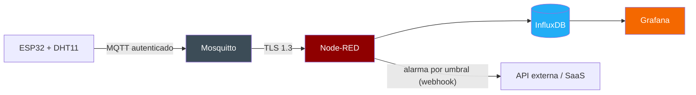
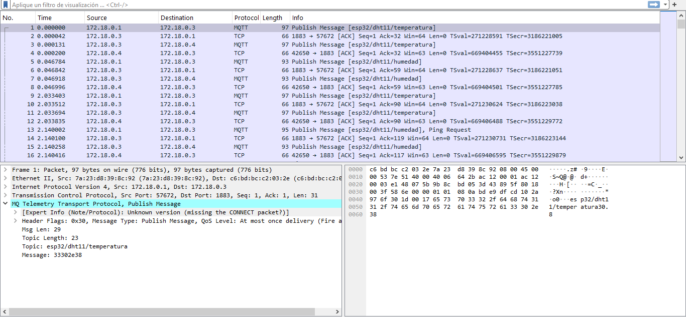
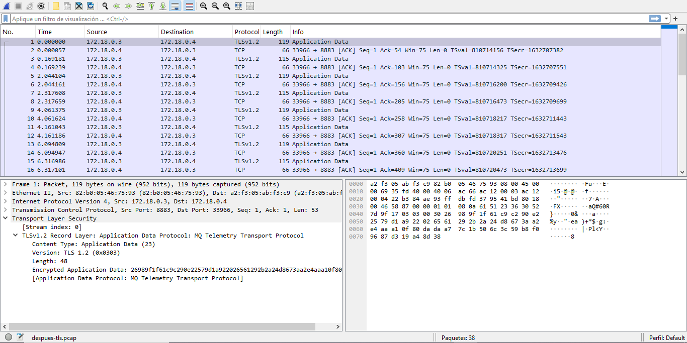
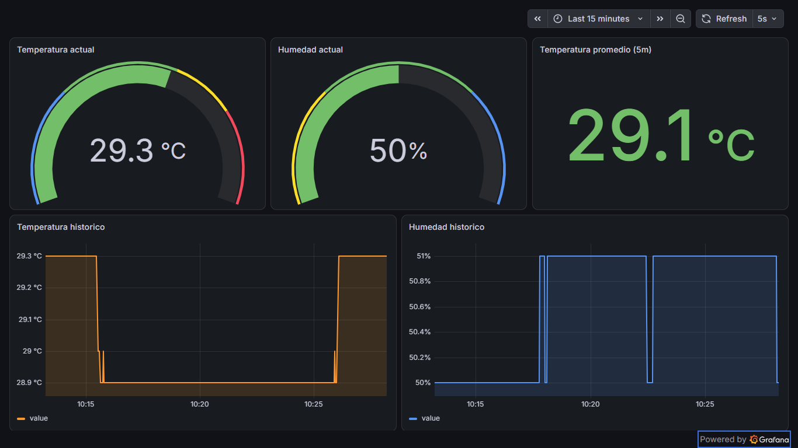
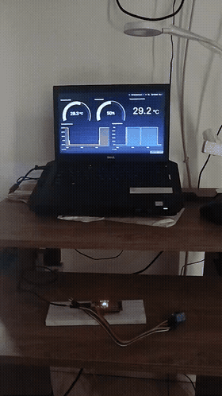

# IoT Industrial Seguro — ESP32 + MQTT + TLS + InfluxDB + Grafana

Plataforma de telemetría IoT extremo a extremo: un sensor DHT11 sobre ESP32 publica lecturas de temperatura y humedad por MQTT, con seguridad en capas (autenticación, control de acceso y cifrado TLS), hacia un stack de persistencia y visualización en tiempo real completamente orquestado con Docker.

Este proyecto no se quedó en "leer un sensor y mostrarlo en una gráfica" — el foco es demostrar cómo se asegura correctamente una arquitectura IoT real, siguiendo los mismos principios que usan plataformas como AWS IoT Core o Azure IoT Hub para la gestión de identidad de dispositivos.

## Arquitectura



Todo el stack de software corre en contenedores Docker orquestados con Docker Compose; el único componente físico es el ESP32.

## Seguridad implementada

Seguridad aplicada en capas sobre toda la arquitectura, validada con evidencia de tráfico real (no solo afirmada):

| Capa | Qué se implementó |
|---|---|
| **Autenticación** | Usuario/contraseña por dispositivo en Mosquitto (`allow_anonymous false`), sin acceso anónimo |
| **Autorización** | ACL por topic — el dispositivo ESP32 solo puede publicar en su propio namespace; Node-RED solo puede leer, no publicar |
| **Cifrado en tránsito** | TLS 1.3 (cipher `TLS_AES_256_GCM_SHA384`) entre Mosquitto y Node-RED, con una **autoridad certificadora (CA) propia** generada con OpenSSL — el mismo patrón de PKI que usan las plataformas IoT en la nube para identidad de dispositivo |
| **Validación con tráfico real** | Se capturó y analizó el tráfico con Wireshark antes y después de cada control: en claro se leían los valores del sensor y hasta las credenciales; cifrado, solo se observa `TLS Application Data` sin poder identificar ni el protocolo |
| **Superficie de ataque** | Escaneo del editor de administración (Node-RED) y cierre del hallazgo más crítico: el editor estaba expuesto sin autenticación (`adminAuth`) |

## Stack técnico

- **Firmware**: C++ / Arduino (PlatformIO), librerías `DHT`, `PubSubClient`, `WiFi`
- **Broker de mensajería**: Eclipse Mosquitto 2 (MQTT + TLS)
- **Integración**: Node-RED
- **Series de tiempo**: InfluxDB 2.0
- **Visualización**: Grafana
- **Orquestación**: Docker Compose
- **Seguridad**: OpenSSL (PKI propia), ACL de Mosquitto, Wireshark (validación)

## Estructura del proyecto

```
├── src/main.cpp              # Firmware del ESP32
├── include/secrets.h         # Credenciales (no versionado)
├── platformio.ini            # Configuración de build/upload
├── docker-compose.yml        # Orquestación de todos los servicios
├── mosquitto/
│   ├── config/                # mosquitto.conf, ACL (passwordfile no versionado)
│   └── certs/                 # CA propia + certificado del servidor (llaves privadas no versionadas)
├── node-red/flow.json         # Flujo exportado (MQTT → InfluxDB)
└── grafana/dashboard.json     # Dashboard exportado (formato API de Grafana)
```

## Cómo correrlo

Copia los archivos de ejemplo y completa tus propios valores:

```bash
cp .env.example .env
cp include/secrets.h.example include/secrets.h
```

El stack de software se levanta independientemente del hardware:

```bash
docker compose up -d
```

Esto expone:
- Grafana en `localhost:3000`
- Node-RED en `localhost:1880` (requiere login, ver nota de seguridad)
- InfluxDB en `localhost:8086`
- Mosquitto en `localhost:1883` (plano, dispositivos) y `localhost:8883` (TLS)

Para reproducir el flujo de Node-RED y el dashboard de Grafana, impórtalos desde `node-red/flow.json` y `grafana/dashboard.json` respectivamente (el JSON de Grafana está en formato de API — para importarlo desde la UI, extraer el objeto interno `dashboard` sin el envoltorio).

La telemetría real requiere el hardware físico (ESP32 + DHT11, cableado DATA→GPIO4); sin él, el stack sigue siendo funcional para inspección de la configuración y la seguridad.

## Capturas

**Tráfico Mosquitto↔Node-RED sin cifrar** — se lee el protocolo `MQTT`, el topic (`esp32/dht11/temperatura`) y el payload en claro (`Message: 33302e38` = "30.8" en hex):



**El mismo tráfico después de activar TLS 1.2/1.3** — Wireshark ya no puede identificar el protocolo interno, solo ve `Application Data` cifrada:



**Dashboard de Grafana con datos reales del ESP32/DHT11:**



**Demo del hardware real:**



## Detección de eventos e integración externa

Node-RED evalúa el umbral de temperatura con **detección de flanco** (solo dispara al cruzar de normal a alarma, no en cada lectura) y un **cooldown de 10 minutos** para no saturar el sistema con la misma alarma. Al dispararse, hace una llamada HTTP POST a un webhook externo con un payload estructurado (`asset_id`, `alarm_type`, `value`, `threshold`, `timestamp`), autenticado con un API key en el header `Authorization`.

## Contexto de portafolio

Este proyecto es la capa de captura y transporte seguro de una arquitectura más amplia de mantenimiento predictivo: al detectar una condición fuera de rango, dispara un evento hacia un backend externo (API REST) responsable de la lógica de negocio (activos, órdenes de trabajo) y del enriquecimiento del evento — una separación de responsabilidades intencional entre la capa IoT y la capa de negocio.
